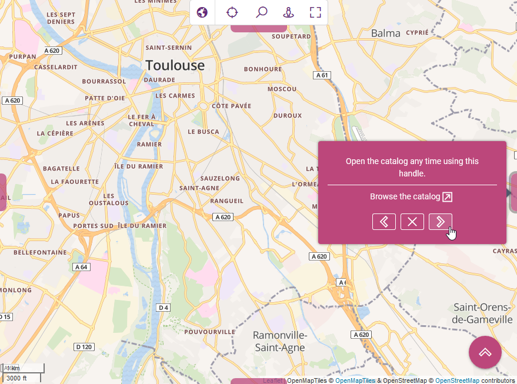

# Getting Started

Kano comes with small *tutorials* that can be directly run on the application in order to understand how its internal components can be used. You will first have to connect to make everything works as expected.

Then, you can launch the main tutorial directly from the main menu through the following icon <a href=""><i class="las la-question-circle"/></a>. Follow the step by step guide <a href=""><i class="las la-chevron-right"/></a>, go back if required <a href=""><i class="las la-chevron-left"/></a> and stop anytime <a href=""><i class="las la-times"/></a> as illustrated by the following figure:

From the main tutorial you can open others tutorials dedicated to specific components (like e.g. the navigation bar) whenever you see the <i class="las la-external-link-square-alt"/> icon.

::: tip
Sometimes you can see a *beta* label on a user interface element (like a button), meaning the feature is currently under *beta test*: in order to improve the first version of the feature we collect feedback from our users.
:::

::: warning
Kano look and features are ever-evolving, moreover it can be configured according to your specific use case. As a consequence, your screen probably looks a little different than what you can read and see in this documentation but the key concepts remain the same.
:::

## Main menu

The main menu allows to open the documentation, manage your settings and logout from Kano.

:point_right: Launch the main tutorial from the main menu then open the link <i class="las la-external-link-square-alt"/> to the main menu tutorial

## Navigation bar

The navigation bar allows to quickly execute recurring actions:
* switch from 2D (respectively 3D) activity to 3D (respectively 2D) activity,
* display the coordinates of a location,
* seek for an address,
* switch to fullscreen mode.

:point_right: Launch the main tutorial from the main menu then open the link <i class="las la-external-link-square-alt"/> to the navigation bar tutorial

## Catalog

The catalog allows to manage the layers displayed on your view. You can show/hide a layer by selecting it in the relevant category.

Using the overflow menu on a layer you can access actions available for this layer like zooming to and for user-defined feature layers saving (i.e. make it persitent), editing properties, editing features, editing display style, display raw data, create charts, delete it.

:point_right: Launch the main tutorial from the main menu then open the link <i class="las la-external-link-square-alt"/> to the catalog tutorial

## Timeline

The timeline allows to quickly execute actions related to the time of the displayed data. Stick to real-time or go forward/backward in time as you wish. 

:point_right: Launch the main tutorial from the main menu then open the link <i class="las la-external-link-square-alt"/> to the timeline tutorial

## Floating action button

Using the FAB you can create a new blank data layer or import existing data as a new data layer. You can also probe weather forecast data at a specific location if your datasets include numerical weather prediction models.

:point_right: Launch the main tutorial from the main menu then open the link <i class="las la-external-link-square-alt"/> to the FAB tutorial
