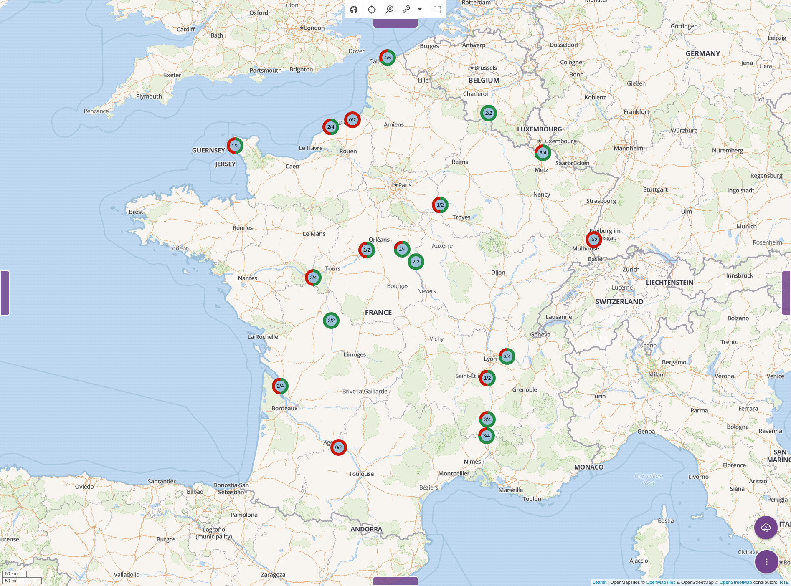
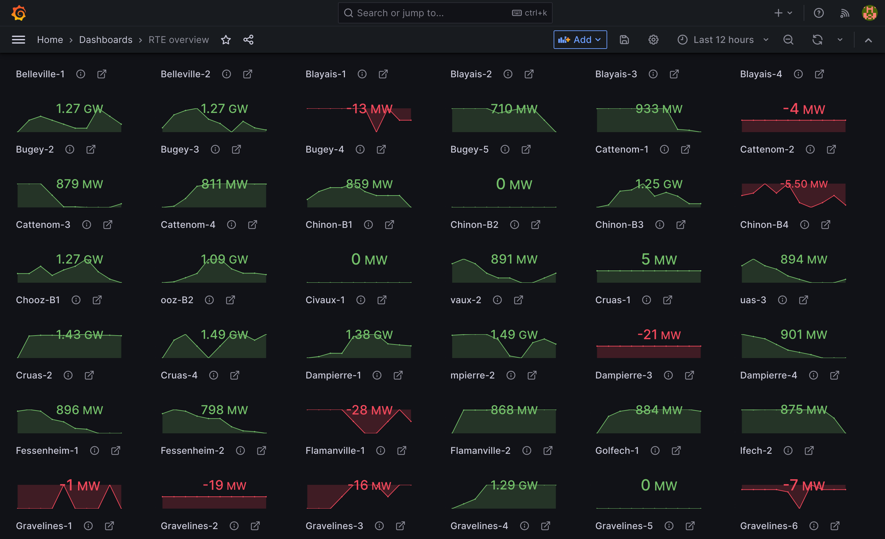
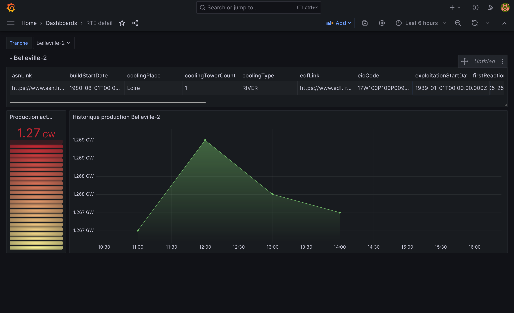

# Using the Kano API

## Description

Kano exposes an API endpoint that can be used to query data stored in it's underlying [MongoDB](https://www.mongodb.com) database. The API will return [JSON](https://www.json.org) documents when queried. The endpoint is located on `$KANO_ROOT_URL/api/`

## What's available

This depends on which layers are declared in your Kano configuration. For each layer declaring a set of [features services](https://kalisio.github.io/kdk/api/map/services.html#features-service), the api will expose the service's data through an URL formed by the API endpoint slash the service name.

::: tip Example
If your Kano instance is exposed through `https://kano.foo.xyz` then the api is available on `https://kano.foo.xyz/api`.
If for example you have the hubeau layer enabled (which instanciate both a `hubeau-stations` and a `hubeau-observations` features services), then the api will expose it's data on `https://kano.foo.xyz/api/hubeau-stations` and `https://kano.foo.xyz/api/hubeau-observations`
:::

## Authentification

In order to access the API, clients must authenticate themselves. We use [JWT](https://jwt.io) tokens to authenticate access to Kano. Those can be added as an HTTP query parameter, using `jwt=$your_token` or can be passed through the `Authorization` HTTP header, using the [`Bearer` scheme](https://datatracker.ietf.org/doc/html/rfc6750).

::: warning TODO
How to generate a JWT token ?
:::

## Queries
  
Queries to the Kano API are made to specific features services data which in turn query their specific underlying MongoDB collection. The way to query those collections is to use [Feathers queries through REST URLs](https://feathersjs.com/api/databases/querying.html). In addition to those, we added in the [KDK](https://kalisio.github.io/kdk) a few [handy shortcuts](https://kalisio.github.io/kdk/api/map/services.html#advanced-feature-filtering) to express commonly used queries.

## Use case example

We used the Kano API to expose French nuclear power production data to a set of [Grafana](https://grafana.com/) dashboards.

We first developed a [Krawler](https://kalisio.github.io/krawler/) job whose task is to scrap power production data and to push it into Kano's backing MongoDB database. On Kano's side, we added a layer declaring a feature service pointing on the database collections the Krawler job was populating. From that time, nuclear power production data was available for display in Kano. Here's what it looks like :

Once the collections started being populated, we looked for ways to connect Grafana to Kano's API endpoint. For this we used the [Infinity Grafana datasource plugin](https://sriramajeyam.com/grafana-infinity-datasource/) allowing us to use it's JSON scrapping capabilities to feed Grafana. We created a JWT token for the datasource to be able to reach Kano's API. After creating dashboards and looking up some docs, we ended up with a set of synthetic dashboards: 

Overall, here's the architecture of the whole solution :

